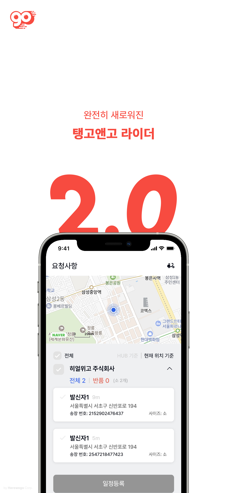

## 전범수 Duke Jeon
Mobile App Developer

Flutter, Dart

**1999.02.17**  
email - 217wjs@naver.com 
github - http://github.com/DukeJeon 
blog - https://velog.io/@217wjs 

> 실수에서 성공을 찾는 개발자

> 사람들이 필요로 하는 것이 무엇인지 고민하는 개발자

> 꼼꼼한 개발자

## 2022
| 기간 | 프로젝트 명 | 내용     |
|:----|:---------|:--------|
| 2022.09. - 진행중 | **탱고앤고** | 배송 라이더를 위한 탱고앤고 라이더 앱 입니다.  **PART** : 프로젝트 아키텍처와 전체적인 디자인을 제외한 모든 부분   **STACK** : `Dart`,  `Kotlin`, `Swift` |

## 2023
| 기간 | 프로젝트 명 | 내용     |
|:----|:---------|:--------|
| 2023.08. - 진행중 | **Instant** | 소셜네트워크 기반의 다이어리 앱 입니다.   **PART** : 프로젝트 아키텍처와 전체적인 디자인을 제외한 모든 부분   **STACK** : `Dart`,  `Kotlin`, `Swift`|

# **프로젝트 상세**
## 탱고앤고

> 배송 라이더를 위한 탱고앤고 라이더 앱 입니다. 
Android Download : https://play.google.com/store/apps/details?id=com.hwego.flutterRider 
iOS Download : https://apps.apple.com/kr/app/%ED%83%B1%EA%B3%A0%EC%95%A4%EA%B3%A0-%EB%9D%BC%EC%9D%B4%EB%8D%94/id1568302767 

- HWEGO에서 진행한 첫번째 프로젝트입니다. 지리적 기반으로 주변 배송 물품을 배달하여 수익을 창출할 수 있는 앱입니다. 

## Instant

> 소셜 네트워크 기반의 다이어리 서비스입니다. 

- PEOPLUS Studio에서 진행한 첫번째 프로젝트입니다. 이제 나 혼자만의 공간, 또는 친구 또는 가족과 함께 당신만의 공간으로 Instant를 채워 나가보세요. 

